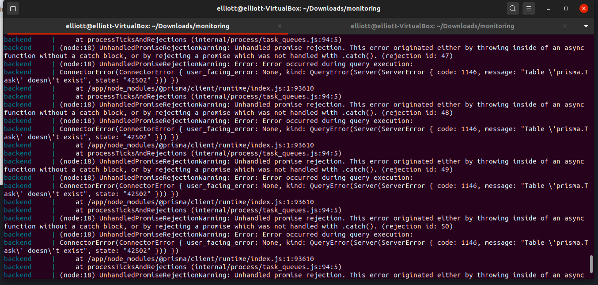

# Server Monitoring Project Overview
## Prerequisites
- docker, docker-compose and npm

## Overview
The system is comprised of two systems: the frontend (localhost:3000) and the backend (localhost:4000). The backend, written in Node, stores data in a mysql database, using prisma to support GraphQL queries. The frontend is written in React.

# Installation/setup guide
## Deploy the containers
1. If this project has been run before (and there are schema changes), run the following commands within the project directory: (otherwise continue to step 2)<br>
`npm run stop` <br> 
`npm run clean` (this will clear the database)

2. Run: <br>
`npm run build` <br> 
`npm start` 

3. After running the first time, you should see errors like this:  
 <br>
This is because the schema has not been replicated in the database. To fix this, run: <br>
`npm run migrate` in the project directory while the containers are running<br>

## Create a user
go to [localhost:4000](http://localhost:4000) in your browser

run the GraphQL mutation below to create a user with admin privileges:
```
mutation user {
  register(email: "admin", password:"admin", isAdmin:true) {
    isAdmin
  }
}
```

## Upload configuration
First, go to [localhost:3000/login](http://localhost:3000/login) and enter email: `admin` and password: `admin`.

Then, go to [localhost:3000/upload](http://localhost:3000/upload) and upload [tasks.json](./tasks.json)

Finally, go to [localhost:3000](http://localhost:3000), and monitor the status of each task. This page relies on websockets to automatically get updates from the server, so you shouldn't need to refresh it. 

## Updating status of tasks
Task executions are saved in the `backend/ingress` directory. Add/rename the files in here and the server will check every 5 seconds for changes, updating the db and /status page. <br>

To view the raw data stored in the database, you can visit [localhost:5555](http://localhost:5555) <br>


# Documentation

## Frontend File Structure (/frontend/src)
/actions - used for redux, describes paramaters for reducers  
/gql - the various GraphQL queries and mutations for interacting with the backend  
/InteractiveModal - Used for things such as preference panes  
/Login - renders the Login page. Contains three files: index, Login and LoginContainer. LoginContainer enabled GraphQL data - providing data as a prop in Login. Login contains the remaining code  
/Menu - the component for the dropdown menu in the navigation  
/Notification - the component for showing notifications in the top right (for examples alerts when something didn't work)  
/reducers - the logic for changing the global store (implemented by Redux). Three stores (authorisation, preferences and tasks) are combined into one store using index
/Status - the code for the Status (Home) page.  
/Status/ExecutionTable - the code for each table displaying executions (expanded in the task table)  
/Status/PreferencesModal - the preferences component (displayed when changing the chip for last recieved executions)  
/Status/StatusRow - the component to display the task within the table  
/Status/TaskSettingsModal - the component to display the preferences modal when editing a task  
/Status/Visualisations - the component for displaying the graph at the bottom of the Status component  
/Upload - The page for uploading new tasks  
/User - The page whenere users can change their preferences (For types of notification they recieve)  
/Navigation.js - An overarching component, displaying the navigation at the top and page at the bottom, providing from authentication logic  
/index.js - Initialises connections (socket and https) with the backend  